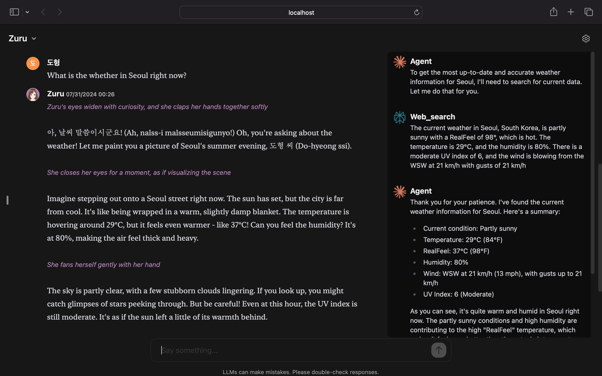

# Chat Boom

Chat Boom is a more friendly and emotional chatbot than other LLM's.  The character AI will respond your request in a way that makes sense to you.



## Features

- 🎭 Character AI: Conveying knowledges in an easy and friendly way. Expressing dynamic emotions and actions. Easily adding new characters on your own.
- 🦸 Agent: Core AI systems for reasoning and calling other LLMs to adjust response. Using Anthropic Claude 3.5 Sonnet.
- 🔎 Web Search: Agent call web search LLM if needed. Using Perplexity.
- 🕵️ Dual View: Displaying Agent and other LLM's original response on seperated window, You can easily reference it.
- 🛡️ Local Data Storage: Using browser managed storage and database, your data remains on your device.
- 📜 Markdown Support: Enhanced readability with markdown and syntax highlighting capabilities.
- 🌟 And more... : Constantly improving Chat Boom with new features!

## How to install

- Clone the repository from Github
```bash

git clone https://github.com/skettee/chat-boom.git

```

- Install dependencies
```bash

cd chat-boom
npm install

```

- Set environment variables
```bash

# rename .env.example to .env
# add your api keys
ANTHROPIC_API_KEY=your-anthropic-api-key
PERPLEXITY_API_KEY=your-pplx-api-key

```

- Start a development server
```bash

npm run dev

# or start the server and open the app in a new browser tab
npm run dev -- --open

```

- Build the application
```bash

npm run build

```

- Start the application
```bash

node -r dotenv/config build

# If you use Node.js v20.6+, you can use the `--env-file`
node --env-file=.env build

```
